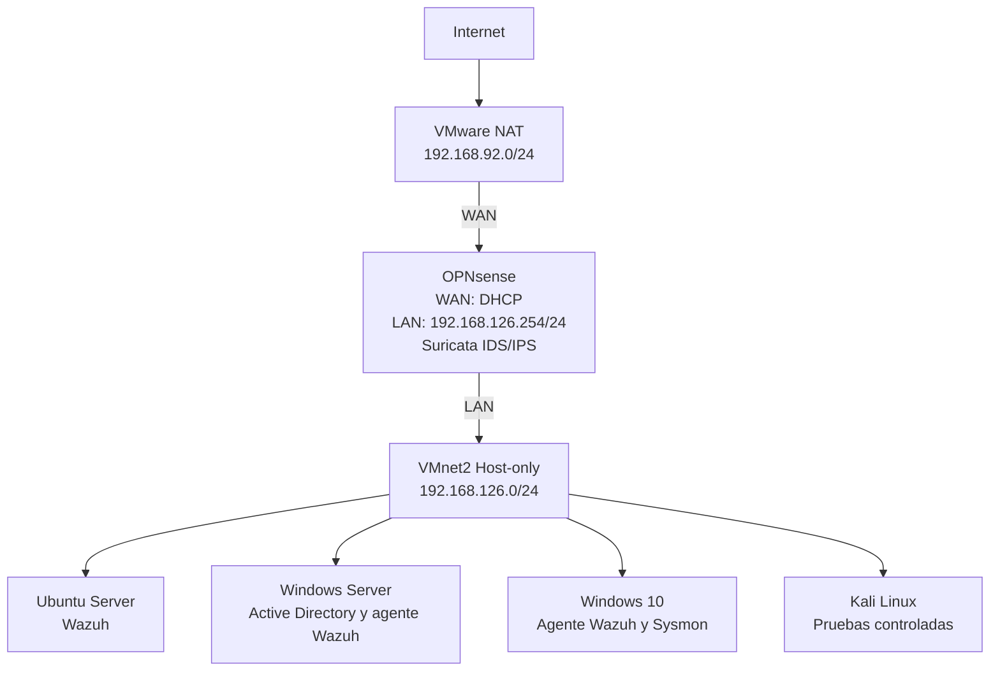

# Topología del laboratorio SOC

## Objetivo

Diseñar una red virtual para un laboratorio SOC en el que OPNsense funcione como firewall, router y puerta de enlace para todas las máquinas virtuales.

El laboratorio permitirá centralizar eventos de seguridad en Wazuh, monitorear endpoints Windows y analizar tráfico de red mediante Suricata.

## Componentes del laboratorio

| Máquina virtual | Sistema operativo | Función |
|---|---|---|
| OPNsense | FreeBSD/OPNsense | Firewall, router, DHCP y plataforma para Suricata |
| Wazuh Server | Ubuntu Server | Wazuh Manager, Indexer y Dashboard |
| Windows Server | Windows Server | Active Directory, DNS y endpoint monitoreado |
| Windows 10 | Windows 10 | Estación de trabajo monitoreada |
| Kali Linux | Kali Linux | Generación de tráfico y pruebas controladas |

## Redes virtuales

| Red | Tipo | Subred | Función |
|---|---|---|---|
| VMware NAT | NAT | 192.168.92.0/24 | Conexión WAN de OPNsense |
| VMnet2 | Host-only | 192.168.126.0/24 | Red LAN interna del laboratorio |

## Interfaces de OPNsense

| Interfaz | Adaptador VMware | Dirección | Función |
|---|---|---|---|
| WAN | NAT | DHCP, actualmente 192.168.92.x | Acceso a Internet |
| LAN | VMnet2 | 192.168.126.254/24 | Gateway de la red interna |

## Servicio DHCP

OPNsense administra la asignación dinámica de direcciones IP para las máquinas conectadas a VMnet2.

| Parámetro | Valor |
|---|---|
| Red | 192.168.126.0/24 |
| Gateway | 192.168.126.254 |
| Inicio del rango DHCP | 192.168.126.100 |
| Final del rango DHCP | 192.168.126.200 |
| Dominio del laboratorio | soc.lab |

## Direccionamiento planificado

Las direcciones que aparecen a continuación son una planificación inicial y podrán ajustarse durante la implementación.

| Equipo | Dirección planificada | Método |
|---|---|---|
| OPNsense LAN | 192.168.126.254 | Estática |
| Ubuntu Server/Wazuh | 192.168.126.10 | Estática |
| Windows Server | 192.168.126.20 | Estática |
| Windows 10 | 192.168.126.100–200 | DHCP |
| Kali Linux | 192.168.126.40 | Estática o DHCP |

## Diagrama de topología

## Flujo del tráfico

1. Los endpoints se conectan a la red VMnet2.
2. OPNsense asigna direcciones IP mediante DHCP cuando corresponda.
3. Los equipos utilizan `192.168.126.254` como puerta de enlace.
4. OPNsense enruta el tráfico desde la LAN hacia la WAN.
5. VMware NAT proporciona la salida a Internet.
6. Suricata inspecciona el tráfico de la red interna.
7. Los agentes instalados en Windows y Ubuntu envían eventos a Wazuh.

## Funciones de seguridad

- Segmentación de la red interna mediante OPNsense.
- Reglas de firewall para controlar el tráfico.
- Inspección del tráfico mediante Suricata.
- Centralización de eventos en Wazuh.
- Monitoreo de Windows mediante agentes Wazuh y Sysmon.
- Generación de tráfico de prueba desde Kali Linux.

## Estado de implementación

- [x] Creación de VMnet2.
- [x] Instalación de OPNsense.
- [x] Configuración de la interfaz WAN.
- [x] Configuración de la interfaz LAN.
- [x] Configuración del servidor DHCP.
- [x] Acceso al panel web de OPNsense.
- [x] Actualización de OPNsense.
- [x] Configuración completa del firewall y NAT.
- [x] Configuración de Suricata.
- [x] Instalación de Ubuntu Server con Wazuh.
- [x] Instalación de Windows Server.
- [x] Instalación de Windows 10.
- [x] Instalación de Kali Linux.
- [x] Integración de los endpoints con Wazuh.
