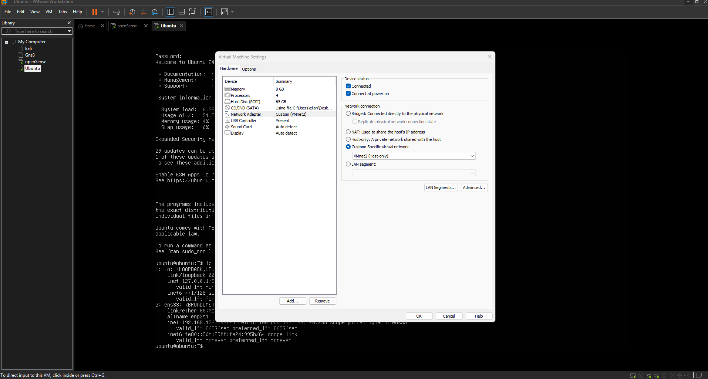
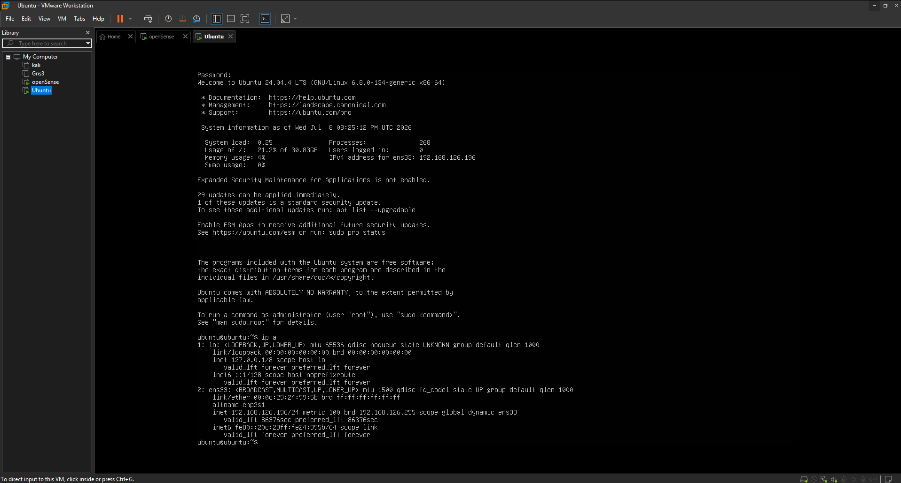
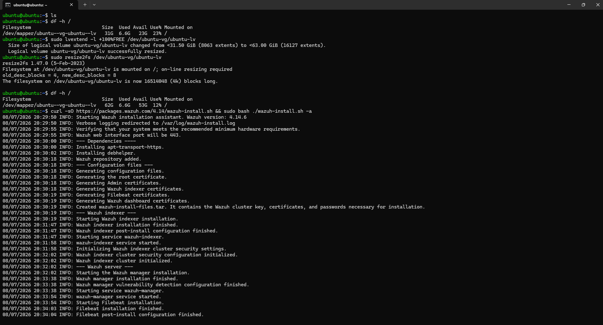
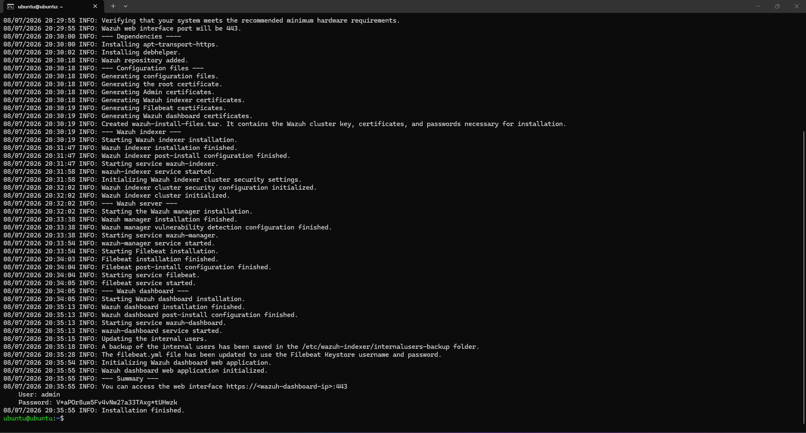
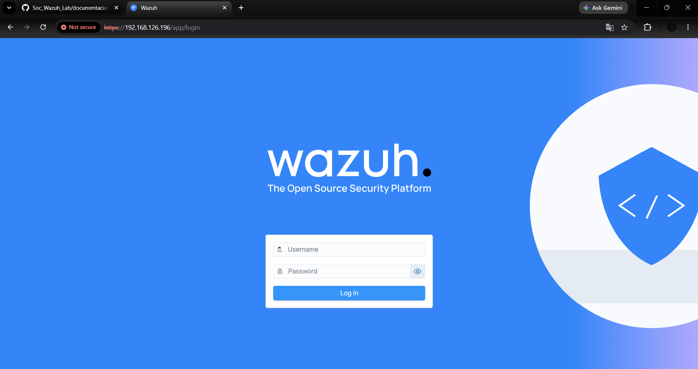
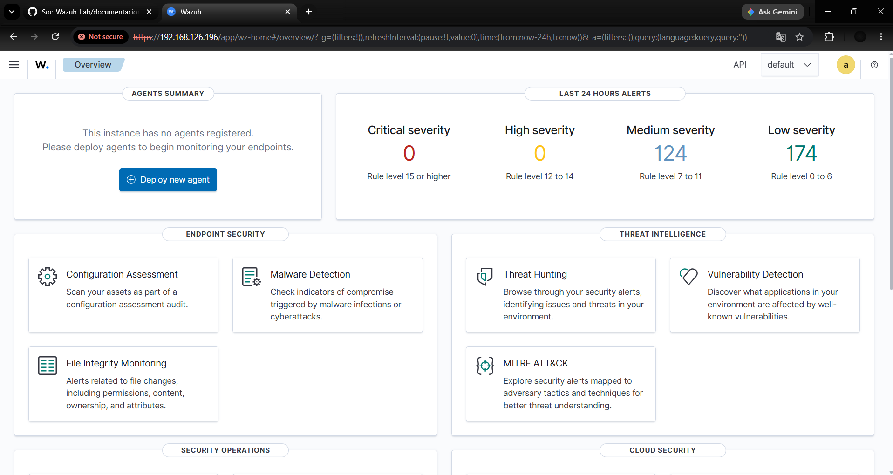
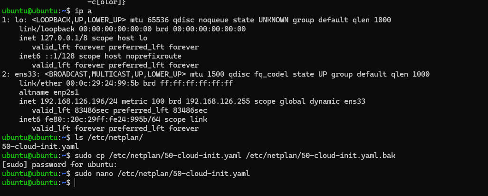
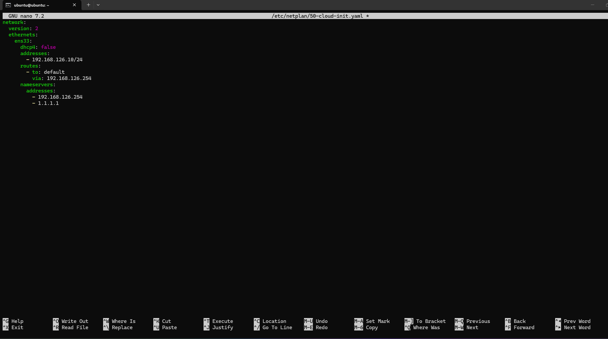
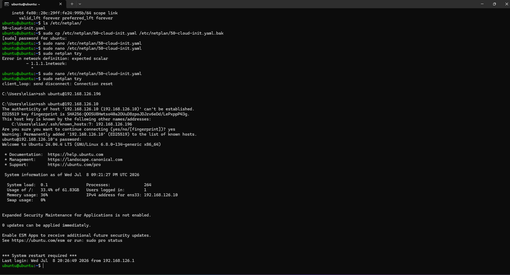
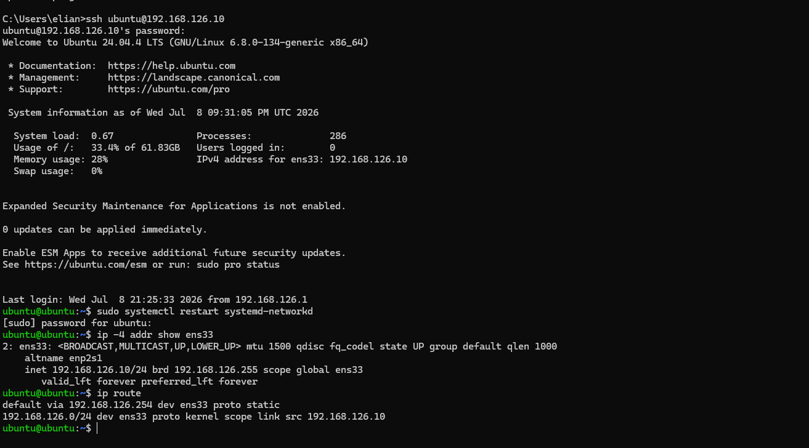

# Instalación y configuración de Ubuntu Server para Wazuh

## Estado

> Completado

## Objetivo

Instalar y configurar Ubuntu Server como servidor central de monitoreo para el laboratorio SOC.

En esta máquina virtual se instalaron los siguientes componentes:

- Wazuh Manager
- Wazuh Indexer
- Wazuh Dashboard
- Filebeat

Además, se configuró una dirección IP estática para garantizar que los equipos monitoreados puedan comunicarse permanentemente con el servidor Wazuh.

---

## Información general del servidor

| Parámetro | Configuración |
|---|---|
| Sistema operativo | Ubuntu Server 24.04.4 LTS |
| Memoria RAM | 8 GB |
| Procesadores | 4 |
| Disco virtual | 65 GB |
| Adaptador de red | VMnet2 |
| Interfaz de red | `ens33` |
| Dirección IP final | `192.168.126.10/24` |
| Puerta de enlace | `192.168.126.254` |
| DNS principal | `192.168.126.254` |
| DNS secundario | `1.1.1.1` |
| URL de Wazuh | `https://192.168.126.10` |

---

# 1. Configuración del adaptador de red

La máquina virtual de Ubuntu Server debe conectarse a la misma red LAN utilizada por los demás equipos del laboratorio.

En VMware Workstation se abrió la configuración de la máquina virtual y se seleccionó el adaptador de red.

El adaptador fue configurado de la siguiente manera:

- Estado del dispositivo: conectado.
- Conectar al iniciar la máquina virtual: habilitado.
- Tipo de red: red virtual personalizada.
- Red seleccionada: `VMnet2`.
- Modo de la red: Host-only.



En esta imagen se observa que el adaptador de red de Ubuntu Server se encuentra conectado a `VMnet2`. Esta es la red LAN interna del laboratorio SOC, donde OPNsense funciona como puerta de enlace y servidor DHCP.

Esta configuración permite que Ubuntu pueda comunicarse con:

- OPNsense.
- Kali Linux.
- Windows Server.
- Windows 10.
- Los futuros agentes de Wazuh.

---

# 2. Verificación inicial de la dirección IP

Después de iniciar Ubuntu Server, se verificó la configuración de red utilizando el siguiente comando:

```bash
ip a
```

El resultado mostró que la interfaz de red utilizada por Ubuntu era:

```text
ens33
```

También se observó que OPNsense había asignado automáticamente la siguiente dirección mediante DHCP:

```text
192.168.126.196/24
```



En esta captura se puede observar el resultado del comando `ip a`.

La línea:

```text
inet 192.168.126.196/24
```

indica que Ubuntu recibió temporalmente la dirección `192.168.126.196` desde el servicio DHCP de OPNsense.

La palabra:

```text
dynamic
```

confirma que la dirección fue asignada automáticamente y que podía cambiar en futuros reinicios.

Esta dirección se utilizó inicialmente para comprobar la conectividad y realizar la instalación de Wazuh.

---

# 3. Verificación y ampliación del almacenamiento

Antes de instalar Wazuh, se verificó el espacio disponible en el volumen principal de Ubuntu:

```bash
df -h /
```

El sistema mostraba que el volumen lógico solo estaba utilizando aproximadamente `31 GB`, aunque el disco virtual configurado en VMware tenía una capacidad mayor.

Para utilizar todo el espacio libre del grupo de volúmenes se ejecutó:

```bash
sudo lvextend -l +100%FREE /dev/ubuntu-vg/ubuntu-lv
```

Después se amplió el sistema de archivos:

```bash
sudo resize2fs /dev/ubuntu-vg/ubuntu-lv
```

Finalmente, se verificó nuevamente el almacenamiento:

```bash
df -h /
```

El volumen principal quedó con aproximadamente `62 GB`.



En esta imagen se muestra el proceso de ampliación del volumen lógico de Ubuntu.

Inicialmente, el sistema tenía alrededor de `31 GB`. Después de ejecutar `lvextend` y `resize2fs`, el espacio disponible aumentó hasta aproximadamente `62 GB`.

En la misma captura también se observa el inicio de la instalación de Wazuh mediante el asistente oficial.

La ampliación del almacenamiento es importante porque Wazuh Indexer puede utilizar una cantidad considerable de espacio para guardar:

- Alertas de seguridad.
- Eventos de los agentes.
- Registros del sistema.
- Índices de OpenSearch.
- Información de vulnerabilidades.

---

# 4. Descarga del instalador de Wazuh

Para descargar el asistente oficial de instalación se ejecutó:

```bash
curl -sO https://packages.wazuh.com/4.14/wazuh-install.sh
```

Este comando descarga el archivo:

```text
wazuh-install.sh
```

Posteriormente, se ejecutó el instalador en modo `all-in-one`:

```bash
sudo bash ./wazuh-install.sh -a
```

La opción:

```text
-a
```

indica que todos los componentes principales de Wazuh serán instalados en el mismo servidor.

Durante la instalación, el asistente realizó automáticamente las siguientes acciones:

1. Verificó los requisitos del sistema.
2. Instaló las dependencias necesarias.
3. Añadió el repositorio oficial de Wazuh.
4. Generó los archivos de configuración.
5. Creó los certificados de seguridad.
6. Instaló Wazuh Indexer.
7. Instaló Wazuh Manager.
8. Instaló y configuró Filebeat.
9. Instaló Wazuh Dashboard.
10. Generó las credenciales administrativas.
11. Inició los servicios de Wazuh.

---

# 5. Finalización de la instalación de Wazuh

Después de completar todos los procesos, el instalador mostró un resumen indicando que la instalación había finalizado correctamente.



En esta imagen se puede observar que los siguientes componentes fueron instalados e iniciados correctamente:

- Wazuh Indexer.
- Wazuh Manager.
- Filebeat.
- Wazuh Dashboard.

También se muestra la dirección de acceso a la interfaz web:

```text
https://<wazuh-dashboard-ip>:443
```

El instalador generó las credenciales del usuario:

```text
admin
```

> La contraseña generada durante la instalación no debe publicarse en GitHub. Antes de subir esta imagen al repositorio, la contraseña debe ocultarse, recortarse o cubrirse.

La instalación fue finalizada con el mensaje:

```text
Installation finished
```

Esto confirma que el servidor Wazuh quedó instalado correctamente.

---

# 6. Primer acceso a la interfaz web

Como Ubuntu todavía utilizaba la dirección obtenida mediante DHCP, se accedió inicialmente al Dashboard desde la siguiente dirección:

```text
https://192.168.126.196
```



En esta imagen se observa la página de inicio de sesión del Dashboard de Wazuh.

El navegador muestra la advertencia:

```text
Not secure
```

Esto ocurre porque Wazuh utiliza inicialmente un certificado autofirmado generado durante la instalación.

La advertencia no significa que Wazuh haya sido instalado incorrectamente. En un entorno de producción se recomienda reemplazar este certificado por uno emitido por una autoridad certificadora confiable.

Para iniciar sesión se utilizaron:

```text
Usuario: admin
Contraseña: generada durante la instalación
```

---

# 7. Verificación del Dashboard de Wazuh

Después de introducir las credenciales administrativas, se accedió correctamente al panel principal.



En esta captura se observa la página principal de Wazuh.

El Dashboard presenta diferentes módulos de seguridad, entre ellos:

- Configuration Assessment.
- Malware Detection.
- File Integrity Monitoring.
- Threat Hunting.
- Vulnerability Detection.
- MITRE ATT&CK.
- Security Operations.
- Cloud Security.

En la sección de agentes aparece el mensaje:

```text
This instance has no agents registered
```

Esto es normal porque todavía no se habían instalado agentes en Windows Server ni en Windows 10.

También se muestran alertas generadas por el propio servidor Wazuh durante las últimas 24 horas.

El acceso exitoso al Dashboard confirmó que:

- Wazuh Dashboard estaba funcionando.
- Wazuh Indexer estaba almacenando eventos.
- Wazuh Manager estaba activo.
- La interfaz web era accesible desde la red LAN.

---

# 8. Preparación de la configuración IP estática

El servidor Wazuh no debe depender de una dirección obtenida por DHCP, ya que los agentes necesitan comunicarse siempre con la misma dirección IP.

Por esta razón, se decidió reemplazar:

```text
192.168.126.196
```

por la dirección estática:

```text
192.168.126.10
```

La configuración planificada fue la siguiente:

| Parámetro | Valor |
|---|---|
| Dirección IP | `192.168.126.10/24` |
| Puerta de enlace | `192.168.126.254` |
| DNS principal | `192.168.126.254` |
| DNS secundario | `1.1.1.1` |
| Interfaz | `ens33` |

La dirección `192.168.126.10` se encuentra fuera del rango DHCP configurado en OPNsense:

```text
192.168.126.100 - 192.168.126.200
```

Esto evita que OPNsense entregue la misma dirección a otro dispositivo.

---

# 9. Identificación y respaldo del archivo de Netplan

Para identificar el archivo utilizado por Ubuntu para la configuración de red se ejecutó:

```bash
ls /etc/netplan/
```

El archivo encontrado fue:

```text
50-cloud-init.yaml
```

Antes de modificarlo, se creó una copia de seguridad:

```bash
sudo cp /etc/netplan/50-cloud-init.yaml /etc/netplan/50-cloud-init.yaml.bak
```

Después se abrió el archivo con el editor Nano:

```bash
sudo nano /etc/netplan/50-cloud-init.yaml
```



En esta captura se muestran tres pasos importantes.

Primero, el comando:

```bash
ls /etc/netplan/
```

permitió identificar el archivo de configuración de red.

Luego se creó una copia de seguridad llamada:

```text
50-cloud-init.yaml.bak
```

Esta copia permite restaurar la configuración anterior en caso de cometer un error.

Finalmente, el archivo original fue abierto con Nano para modificar la dirección IP.

---

# 10. Configuración de la dirección IP estática

Dentro del archivo de Netplan se reemplazó la configuración DHCP por una configuración manual.

El contenido utilizado fue:

```yaml
network:
  version: 2
  ethernets:
    ens33:
      dhcp4: false
      addresses:
        - 192.168.126.10/24
      routes:
        - to: default
          via: 192.168.126.254
      nameservers:
        addresses:
          - 192.168.126.254
          - 1.1.1.1
```



En esta imagen se observa la configuración escrita dentro del archivo `50-cloud-init.yaml`.

La opción:

```yaml
dhcp4: false
```

desactiva la asignación automática de direcciones IPv4.

La sección:

```yaml
addresses:
  - 192.168.126.10/24
```

asigna la dirección IP estática al servidor.

La ruta:

```yaml
routes:
  - to: default
    via: 192.168.126.254
```

establece a OPNsense como puerta de enlace predeterminada.

Finalmente, se configuraron dos servidores DNS:

```text
192.168.126.254
1.1.1.1
```

La indentación del archivo YAML debe realizarse utilizando espacios. No se deben utilizar tabulaciones.

Para guardar el archivo en Nano se utilizó:

```text
Ctrl + O
Enter
Ctrl + X
```

---

# 11. Prueba de la nueva configuración de red

Después de guardar el archivo, se probó la configuración con:

```bash
sudo netplan try
```

Al cambiar la dirección de `192.168.126.196` a `192.168.126.10`, la conexión SSH existente se cerró.

Esto ocurrió porque la sesión estaba conectada a la dirección anterior.

Desde el equipo anfitrión se intentó nuevamente el acceso mediante:

```bash
ssh ubuntu@192.168.126.10
```



En esta captura se observa que la primera conexión SSH se desconectó cuando Netplan aplicó el cambio.

Posteriormente, se realizó una nueva conexión utilizando:

```text
192.168.126.10
```

Durante la primera conexión a la nueva dirección, SSH mostró una advertencia relacionada con la huella digital del servidor.

Esto ocurrió porque el mismo servidor estaba siendo contactado mediante una dirección IP diferente.

Después de aceptar la huella digital e introducir la contraseña del usuario `ubuntu`, se accedió correctamente al servidor.

La información del sistema confirmó:

```text
IPv4 address for ens33: 192.168.126.10
```

Esto demostró que la nueva dirección estaba funcionando.

---

# 12. Aplicación permanente de la configuración

Para aplicar definitivamente la configuración se ejecutó:

```bash
sudo netplan apply
```

También se reinició el servicio encargado de administrar la red:

```bash
sudo systemctl restart systemd-networkd
```

Después se verificó la dirección configurada:

```bash
ip -4 addr show ens33
```

Y se comprobó la tabla de enrutamiento:

```bash
ip route
```



En esta imagen se observa que la interfaz `ens33` tiene configurada la dirección:

```text
inet 192.168.126.10/24
```

La línea:

```text
valid_lft forever
```

indica que la dirección no tiene un tiempo de concesión DHCP y que permanecerá configurada de forma estática.

La tabla de enrutamiento también muestra:

```text
default via 192.168.126.254 dev ens33 proto static
```

Esto confirma que OPNsense quedó correctamente configurado como puerta de enlace.

La ruta local:

```text
192.168.126.0/24 dev ens33
```

confirma que el servidor pertenece a la red LAN del laboratorio SOC.

---

# 13. Pruebas de conectividad

Después de configurar la dirección IP estática, se realizaron pruebas para comprobar el funcionamiento de la red.

## Comunicación con OPNsense

```bash
ping -c 4 192.168.126.254
```

Esta prueba verifica que Ubuntu puede comunicarse con la puerta de enlace.

## Comunicación con Internet

```bash
ping -c 4 1.1.1.1
```

Esta prueba verifica que OPNsense permite la salida de Ubuntu hacia Internet.

## Resolución de nombres

```bash
ping -c 4 google.com
```

Esta prueba permite comprobar que los servidores DNS están funcionando correctamente.

---

# 14. Verificación de los servicios de Wazuh

Para verificar el estado de los componentes instalados se pueden utilizar los siguientes comandos:

```bash
sudo systemctl status wazuh-manager
```

```bash
sudo systemctl status wazuh-indexer
```

```bash
sudo systemctl status wazuh-dashboard
```

```bash
sudo systemctl status filebeat
```

Los servicios deben aparecer con el estado:

```text
active (running)
```

También se puede realizar una comprobación rápida con:

```bash
sudo systemctl is-active wazuh-manager wazuh-indexer wazuh-dashboard filebeat
```

---

# 15. Acceso definitivo al Dashboard

Después de configurar la dirección estática, el acceso definitivo a Wazuh quedó disponible en:

```text
https://192.168.126.10
```

Esta dirección será utilizada posteriormente para:

- Acceder al Dashboard.
- Registrar agentes.
- Monitorear Windows Server.
- Monitorear Windows 10.
- Recibir eventos de seguridad.
- Consultar alertas.
- Realizar búsquedas de amenazas.
- Integrar eventos de Suricata.

---

# Resultado final

Ubuntu Server quedó instalado y configurado correctamente como servidor central de Wazuh para el laboratorio SOC.

La configuración final es:

| Componente | Resultado |
|---|---|
| Ubuntu Server | Instalado |
| Adaptador de red | Conectado a VMnet2 |
| Interfaz | `ens33` |
| Dirección IP inicial | `192.168.126.196` mediante DHCP |
| Dirección IP final | `192.168.126.10/24` estática |
| Puerta de enlace | `192.168.126.254` |
| Wazuh Manager | Instalado y activo |
| Wazuh Indexer | Instalado y activo |
| Wazuh Dashboard | Instalado y activo |
| Filebeat | Instalado y activo |
| Acceso web | `https://192.168.126.10` |
| Agentes registrados | Pendientes |

El servidor quedó preparado para continuar con la instalación de Windows Server, Windows 10 y sus respectivos agentes de Wazuh.
