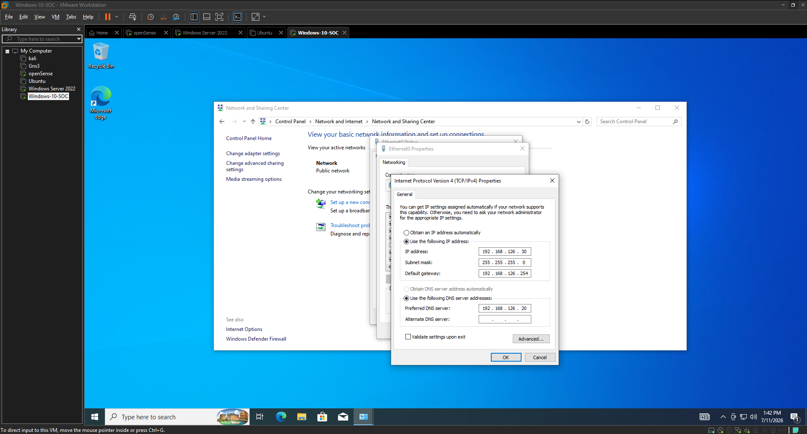
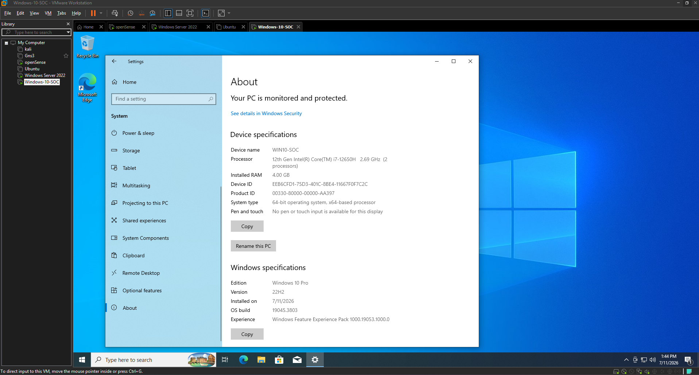
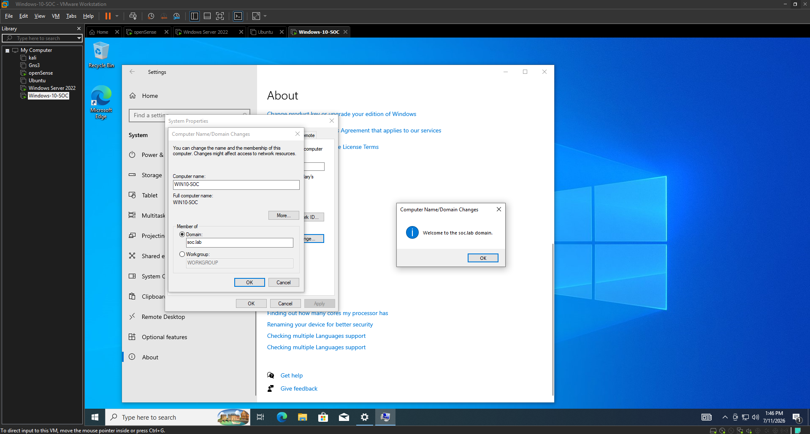

# Configuración de Windows 10

## Estado

> Completado

## Objetivo

Configurar Windows 10 como equipo cliente del laboratorio SOC, asignarle una dirección IP estática, verificar el nombre y la edición del sistema operativo, unirlo al dominio `soc.lab` e iniciar sesión con un usuario creado previamente en Active Directory.

## Datos del equipo

| Parámetro | Configuración |
|---|---|
| Nombre del equipo | `WIN10-SOC` |
| Sistema operativo | Windows 10 Pro 22H2 |
| Dirección IP | `192.168.126.30` |
| Máscara de subred | `255.255.255.0` |
| Puerta de enlace | `192.168.126.254` |
| Servidor DNS | `192.168.126.20` |
| Dominio | `soc.lab` |
| Controlador de dominio | `SRV-DC01` |

## Configuración de la dirección IP estática

La máquina virtual de Windows 10 fue conectada a la red interna `VMnet2`, utilizada por los dispositivos del laboratorio SOC.

En las propiedades de `Internet Protocol Version 4 (TCP/IPv4)` se configuraron manualmente los siguientes valores:

- Dirección IP: `192.168.126.30`
- Máscara de subred: `255.255.255.0`
- Puerta de enlace: `192.168.126.254`
- DNS preferido: `192.168.126.20`
- DNS alternativo: vacío

La dirección `192.168.126.254` corresponde a la interfaz LAN de OPNsense y funciona como puerta de enlace.

La dirección `192.168.126.20` corresponde al controlador de dominio `SRV-DC01`, que también proporciona el servicio DNS para `soc.lab`.

En la siguiente captura se observa la configuración IPv4 estática aplicada al equipo Windows 10.

## Verificación del nombre y la edición de Windows

Después de configurar la red, se verificaron las especificaciones del sistema desde la sección **About** de Windows.

Se confirmó que el nombre del equipo es:

`WIN10-SOC`

También se verificó que el sistema operativo instalado es:

`Windows 10 Pro 22H2`

La edición Windows 10 Pro permite unir el equipo a un dominio de Active Directory.

En la siguiente captura se muestra la información del sistema, donde se confirma el nombre del equipo, la edición instalada, la versión 22H2 y la arquitectura de 64 bits.

## Unión de Windows 10 al dominio

Después de comprobar la comunicación con el controlador de dominio y el servidor DNS, se procedió a unir el equipo al dominio:

`soc.lab`

Para realizar este proceso se utilizaron credenciales con privilegios administrativos dentro del dominio.

Windows mostró el mensaje:

`Welcome to the soc.lab domain.`

Este mensaje confirmó que el equipo `WIN10-SOC` fue agregado correctamente al dominio de Active Directory.

En la siguiente captura se observa el mensaje de confirmación presentado por Windows después de completar la unión al dominio `soc.lab`.

## Reinicio del equipo

Después de unir el equipo al dominio, Windows solicitó reiniciar el sistema para aplicar los cambios.

Una vez reiniciado, `WIN10-SOC` quedó registrado correctamente como miembro del dominio `soc.lab`.

## Inicio de sesión con el usuario del dominio

En la pantalla de inicio de sesión se utilizaron las credenciales del usuario creado previamente en Active Directory:

`usuario.soc@soc.lab`

También puede utilizarse el formato:

`SOC\usuario.soc`

El inicio de sesión se realizó correctamente, confirmando que:

- Windows 10 puede comunicarse con el controlador de dominio.
- El servicio DNS resuelve correctamente el dominio.
- El usuario creado en Active Directory puede autenticarse.
- El equipo pertenece correctamente al dominio `soc.lab`.

## Resultado final

Windows 10 quedó configurado correctamente como equipo cliente del laboratorio SOC.

Se completaron las siguientes tareas:

- Configuración de una dirección IP estática.
- Configuración de OPNsense como puerta de enlace.
- Configuración de `SRV-DC01` como servidor DNS.
- Asignación del nombre `WIN10-SOC`.
- Verificación de Windows 10 Pro.
- Unión exitosa al dominio `soc.lab`.
- Inicio de sesión exitoso con el usuario de Active Directory.

El equipo quedó preparado para la instalación del agente de Wazuh, Sysmon y la generación de eventos de seguridad.
